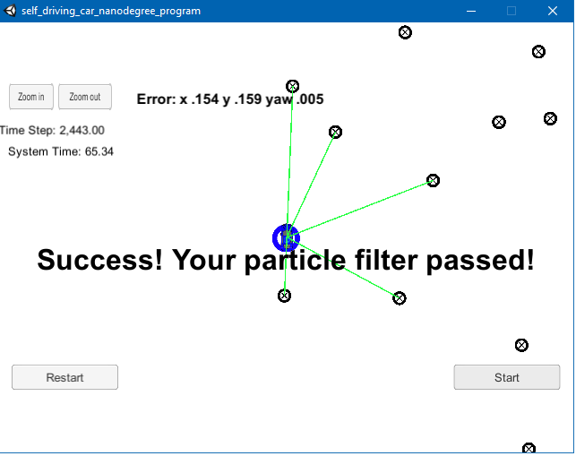

# Overview
This repository contains all the code needed to complete the final project for the Localization course in Udacity's Self-Driving Car Nanodegree.

#### Submission
All you will submit is your completed version of `particle_filter.cpp`, which is located in the `src` directory. You should probably do a `git pull` before submitting to verify that your project passes the most up-to-date version of the grading code (there are some parameters in `src/main.cpp` which govern the requirements on accuracy and run time.)

## Project Introduction
Your robot has been kidnapped and transported to a new location! Luckily it has a map of this location, a (noisy) GPS estimate of its initial location, and lots of (noisy) sensor and control data.

In this project you will implement a 2 dimensional particle filter in C++. Your particle filter will be given a map and some initial localization information (analogous to what a GPS would provide). At each time step your filter will also get observation and control data. 

## Running the Code
This project involves the Term 2 Simulator which can be downloaded [here](https://github.com/udacity/self-driving-car-sim/releases)

This repository includes two files that can be used to set up and intall uWebSocketIO for either Linux or Mac systems. For windows you can use either Docker, VMware, or even Windows 10 Bash on Ubuntu to install uWebSocketIO.

Once the install for uWebSocketIO is complete, the main program can be built and ran by doing the following from the project top directory.

1. mkdir build
2. cd build
3. cmake ..
4. make
5. ./particle_filter

Alternatively some scripts have been included to streamline this process, these can be leveraged by executing the following in the top directory of the project:

1. ./clean.sh
2. ./build.sh
3. ./run.sh

You will see a message indicating the filter is listening:

```
> ./run.sh
Listening to port 4567

```

Download and open the self driving car nano degree term2 simulator (https://github.com/udacity/self-driving-car-sim/releases).

Use the right arrow to go to the Kidnapped Vehicle project:


Clicking on "Select," the simulator for the Kidnapped project start and the Particle Filter informs it is connected:


Clicking on "Start" button, the vehicle starts moving, and the blue circle(the filter calculated position) moves with it. After a while, the simulator informs you if your Particle Filter passed or failed. Here is an example of the filter passing the test:



# Code description

Each major step involved in implementation is illustrated below:


The C++ program for localization was implemented using following major steps:

1. A noisy measurement from GPS sensor was received and used to initialize the position of vehicle. This measurement included the x coordinate, y coordinate (both in m) and the theta (orientation) of vehicle in radian. Noise is modelled by Gaussian distribution with standard deviation in x, y and theta provided as a part of GPS uncertainty specification. Particle filter algorithm uses particles to represent the location of vehicle. Hence, in this case, 20 particles were created and initialized to locations taken from normal distribution with mean equal to the location received from GPS and standard deviation equal to the GPS measurement uncertainty. The number of particles was a tunable parameter and was chosen after multiple iterations described in later steps of implementation.

2. Global map of environment is initialized. This map is represented by a list x and y coordinates of landmarks in the environment.

3. Once map and particles are initialized, the vehicle implements Prediction step in which the location of each particle at next time step is predicted. This is done by using information of control inputs and time elapsed between time steps. The control inputs are nothing but magnitude of velocity (v) and yaw rate (θ). Location update is done with the help of formula given below:

4. After prediction step, the vehicle implements Update step. In this step, particles are assigned with weights corresponding to their prediction. 


The Particle Filter is implemented in [src/particle_filter.cpp](./src/particle_filter.cpp):

- Initialization: Particle initialization is implemented at [ParticleFilter::init](./src/particle_filter.cpp#L24) from line 24 to line 62.

- Prediction: The prediction step is implemented at [ParticleFilter::prediction](./src/particle_filter.cpp#L64) from line 64 to line 100.

- Weight's update: This is the more important operation in my opinion. It is implemented at [ParticleFilter::updateWeights](./src/particle_filter.cpp#L64) from line 138 to line 217.


